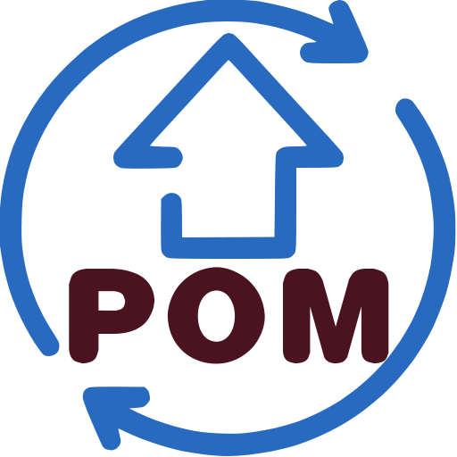
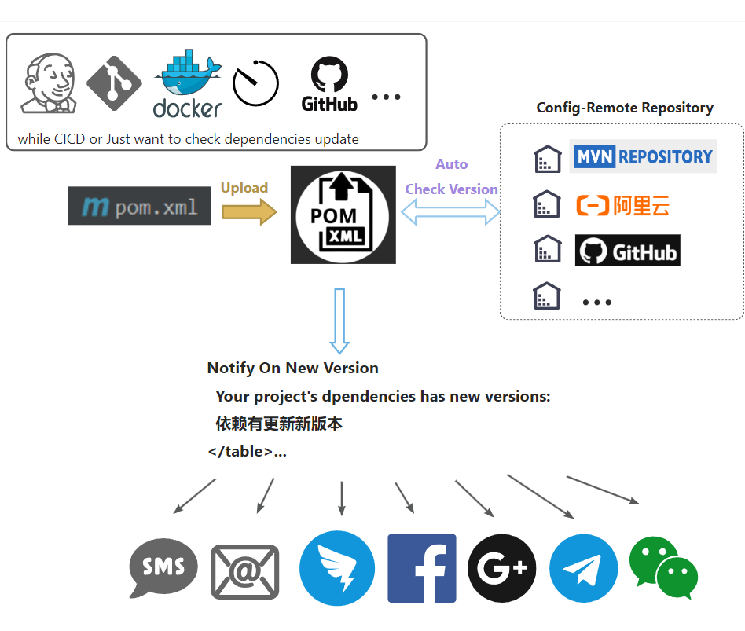

<h1 align="center"><a href="https://github.com/ChinaLym/pom-update" target="_blank">Pom-Update</a></h1>

# 📖Introduction [中文 language](README_zh.md)

准备翻译中~~~~~ 点赞加速 **[🌟Star](https://gitee.com/ChinaLym/pom-update/star)**


Check if there are updates to the direct dependencies of your maven project.



# 🚀 Quick Start

## 🌏 [Web UI](http://autopom.itlym.cn/) 👈

**upload a `pom.xml`** and wait an email if there were any new version of the dependencies in your project.

## ⌨ Command Line

Copy this to your browser，**Note**: Replace the **📧Email**（`yourEmail@demo.com`） and **🔗pom.xml link** into yours.

> http://autopom.itlym.cn/projects/createWithUrl?email=yourEmail@demo.com&pomXmlUrl=https://raw.githubusercontent.com/ChinaLym/shoulder-framework/master/shoulder-dependencies/pom.xml&notifyInstantlyAfterCheck=true&notifyReason=ONLY_TEST_DEMO

> [Issue on Github if any questions](https://github.com/ChinaLym/pom-update/issues/new#留言自动激活邮箱还未打通，作者看到回)

# ✈ Run with local

1. `git clone https://github.com/ChinaLym/pom-update`

2. Create tables in your database like [pom-update-schema-and-demo-data.sql](pom-update-schema-and-demo-data.sql).

3. Configuration:
- Way 1: Fill the database、email in `application.properties`.
- Way 2: Use env variables.

```text
# Email: such as demo@qq.com
TEST_SENDER_EMAIL
# Email: SFTP Token
TEST_EMAIL_TOKEN
# MYSQL url and password
MYSQL_ADDR
MYSQL_PWD
```

# ✨ Compare with maven plugins
与 maven 的 `mvn versions:display-dependency-updates` 相比

- pom-update 的第三方版本信息非实时（时间间隔3小时）；maven 是实时检测的，每个依赖都需要至少访问一次中央仓库
- pom-update 的检测时间在毫秒-秒级，并发检测 + 缓存（内存比较无网络）；maven 的检测通常在分钟级，大型项目检测时往往几十分钟
- pom-update 只检测直接依赖 / 自行管理版本的间接依赖，如依赖了 spring-boot，间接依赖（如spring-core) 的版本是不纳入检测的（当且仅当自己在 dependencyManager 中指定了它的版本或显示指定其版本依赖）有利于维护责任独立更轻量；maven 会检测所有依赖以及全部间接依赖
- pom-update 是部署在服务端，不消耗客户端性能，检测时直接出结果；maven 的必须要客户端等待检测结果
- pom-update 可定时检测，支持订阅，如每周发送更新邮件，并能根据是否稳定版设置是否发送邮件通知；maven 不可以

**📒 In a world：**

- pom-update 秒级出检测结果，不需要数十分钟等待获取一大堆自己部管理也不关心的间接依赖版本
- pom-update 支持订阅，如每周发送本项目的所有依赖版本变化情况

# 🛰 Endpoint

## Test Page
http://localhost:12345/index.html

## Check all projects' dependencies if there were new releases version.
http://localhost:12345/test/version

## Send Email notification.
http://localhost:12345/test/notify

## Notification settings
http://localhost:12345/dependencies/updateNotifyStrategy?projectId=10&notifyStrategy=ALWAYS&email=your@demoemail.com

```bash
# TEMP TEST
curl --location --request GET 'http://localhost:12345/projects/createWithUrl?email=yourEmail@demo.com&pomXmlUrl=https://raw.githubusercontent.com/ChinaLym/shoulder-framework/master/shoulder-dependencies/pom.xml&notifyInstantlyAfterCheck=true&notifyReason=ONLY_TEST_DEMO' || echo '======= SKIP dependency check. ======='
```
```bash
# POST
curl --location --request POST 'http://localhost:12345/projects/create' --form 'email=yourEmail@demo.com' --form 'pomXml=@shoulder-dependencies/pom.xml' --form 'notifyInstantlyAfterCheck=true' --form 'notifyReason=CI-<a href="https://cicd.yourdomain.com/xxx/${DRONE_REPO_NAME}">${DRONE_REPO_NAME}::${DRONE_REPO_BRANCH}</a><br> with <a href="https://cicd.yourdomain.cn/gogs/${DRONE_REPO_NAME}/${DRONE_BUILD_NUMBER}">Drone Build-${DRONE_BUILD_NUMBER}</a><br>' || echo '======= SKIP dependency check. ======='
```
