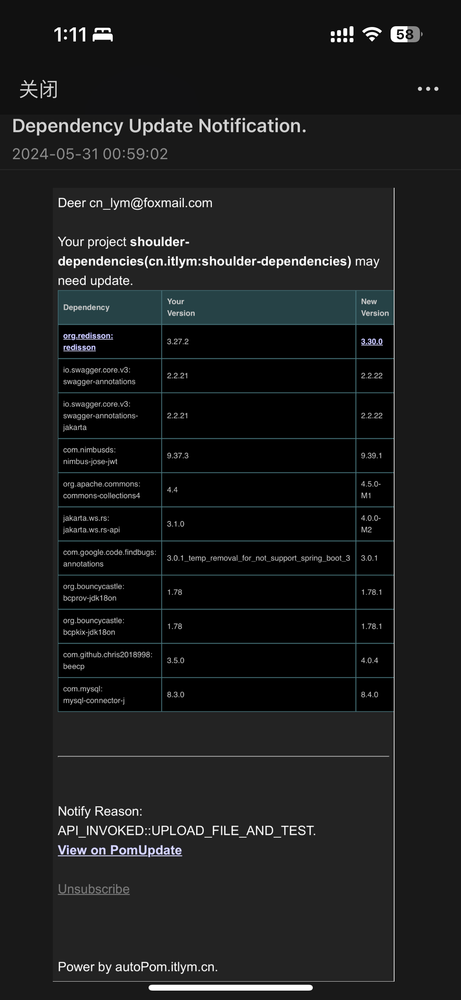

<h1 align="center"><a href="https://github.com/ChinaLym/pom-update" target="_blank">Pom-Update</a></h1>

# 📖介绍 [English language](README.md)

快速检查 maven 工程中依赖是否可以升级版本.

**💪 100 倍** 的性能于 maven 官方插件 `mvn versions:display-dependency-updates`.


# 🚀 立即体验

一步操作，您工程的依赖更新后，您将收到一封邮件，如下：（默认是早上9:00 才会发邮件）



## 🌏 [页面体验](https://autopom.itlym.cn/index-CN.html) 👈

**上传 `pom.xml`** 如果有依赖可以升级则会向你发送邮件.

## ⌨ 组装 url 访问（便于程序中 / curl 访问)

复制以下 url，修改 **📧Email**（`yourEmail@demo.com`） 和 **🔗pom.xml 地址** 到浏览器地址栏回车。

> http://autopom.itlym.cn/projects/createWithUrl?email=yourEmail@demo.com&pomXmlUrl=https://raw.githubusercontent.com/ChinaLym/shoulder-framework/master/shoulder-dependencies/pom.xml&notifyInstantlyAfterCheck=true&notifyReason=ONLY_TEST_DEMO

# ✈ 本地运行

⚡ 下载代码直接运行在 `localhost:12345` ！

```bash
git clone https://github.com/ChinaLym/pom-update
````

如果想使用通知功能, 则可以修改 `application.properties` 配置激活。

# 🚢 Docker 运行（私有部署）

```bash
docker run -p 12345:12345 -d --name pom-update \
	-e EMAIL_SENDER_ADDR="your_email@xxx.com" \
	-e EMAIL_TOKEN="your_email_token" \
	-e DB_TYPE="h2" \
    registry.cn-hangzhou.aliyuncs.com/itlym/pom-update
```

env:
```text
# Email: such as demo@qq.com
EMAIL_SENDER_ADDR
# Email: SFTP Token
EMAIL_TOKEN
# MYSQL url and password
DB_TYPE(mysql / h2)
MYSQL_ADDR(localhost:3306)
H2_FILE_PATH(~/pomUpdateDb)
DB_USER(pom_update)
DB_PWD(pompompom)
LOG_LEVEL(debug/info/warn/error)
```

# ✨ 比 maven 插件检测 **更快！**

与 maven 的 `mvn versions:display-dependency-updates` 相比

- pom-update 的第三方版本信息非实时（时间间隔3小时）；maven 是实时检测的，每个依赖都需要至少访问一次中央仓库
- pom-update 的检测时间在毫秒-秒级，并发检测 + 缓存（内存比较无网络）；maven 的检测通常在分钟级，大型项目检测时往往几十分钟
- pom-update 只检测直接依赖 / 自行管理版本的间接依赖，如依赖了 spring-boot，间接依赖（如spring-core) 的版本是不纳入检测的（当且仅当自己在 dependencyManager 中指定了它的版本或显示指定其版本依赖）有利于维护责任独立更轻量；maven 会检测所有依赖以及全部间接依赖
- pom-update 是部署在服务端，不消耗客户端性能，检测时直接出结果；maven 的必须要客户端等待检测结果
- pom-update 可定时检测，支持订阅，如每周发送更新邮件，并能根据是否稳定版设置是否发送邮件通知；maven 不可以

**📒 总结：**

- pom-update 秒级出检测结果，不需要数十分钟等待获取一大堆自己部管理也不关心的间接依赖版本
- pom-update 支持订阅，如每周发送本项目的所有依赖版本变化情况

# 🛰 测试接口说明

## 测试页
http://localhost:12345/index.html

## 根据中央仓库检查已经导入的所有工程（pom.xml）的依赖是否有更新（会比较慢），如果有则生成待通知记录
http://localhost:12345/test/version

## 将所有待通知记录发送邮件通知
http://localhost:12345/test/notify

## 通知策略设置，如可设置：`有新版就通知`、`新稳定版才通知`...
http://localhost:12345/dependencies/updateNotifyStrategy?projectId=10&notifyStrategy=ALWAYS&email=your@demoemail.com

```bash
# TEMP TEST
curl --location --request GET 'http://localhost:12345/projects/createWithUrl?email=yourEmail@demo.com&pomXmlUrl=https://raw.githubusercontent.com/ChinaLym/shoulder-framework/master/shoulder-dependencies/pom.xml&notifyInstantlyAfterCheck=true&notifyReason=ONLY_TEST_DEMO' || echo '======= SKIP dependency check. ======='
```
```bash
# POST
curl --location --request POST 'http://localhost:12345/projects/create' --form 'email=yourEmail@demo.com' --form 'pomXml=@shoulder-dependencies/pom.xml' --form 'notifyInstantlyAfterCheck=true' --form 'notifyReason=CI-<a href="https://cicd.yourdomain.com/xxx/${DRONE_REPO_NAME}">${DRONE_REPO_NAME}::${DRONE_REPO_BRANCH}</a><br> with <a href="https://cicd.yourdomain.cn/gogs/${DRONE_REPO_NAME}/${DRONE_BUILD_NUMBER}">Drone Build-${DRONE_BUILD_NUMBER}</a><br>' || echo '======= SKIP dependency check. ======='
```

## 更多

- [run_with_docker.md](doc/run_with_docker.md)
