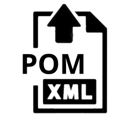

<h1 align="center"><a href="https://github.com/ChinaLym/pom-update" target="_blank">Pom-Update</a></h1>

# 📖Introduction [中文 language](README_zh.md)

Check if there are updates to the direct dependencies of your maven project.


# 🚀 Quick Start

## 🌏 [Web UI](http://autopom.itlym.cn/) 👈

**upload a `pom.xml`** and wait an email if there were any new version of the dependencies in your project.

## ⌨ Command Line

Copy this to your browser，**Note**: Replace the **📧Email**（`yourEmail@demo.com`） and **🔗pom.xml link** into yours.

> http://autopom.itlym.cn/projects/createWithUrl?email=yourEmail@demo.com&pomXmlUrl=https://raw.githubusercontent.com/ChinaLym/shoulder-framework/master/shoulder-dependencies/pom.xml&notifyInstantlyAfterCheck=true&notifyReason=ONLY_TEST_DEMO

> [Issue on Github if any questions](https://github.com/ChinaLym/pom-update/issues/new#留言自动激活邮箱还未打通，作者看到回)

# ✈ Run with local

1. `git clone https://github.com/ChinaLym/pom-update`

2. Create tables in your database like [pom-update-schema-and-demo-data.sql](pom-update-schema-and-demo-data.sql).

3. Configuration:
- Way 1: Fill the database、email in `application.properties`.
- Way 2: Use env variables.

```text
# Email: such as demo@qq.com
TEST_SENDER_EMAIL
# Email: SFTP Token
TEST_EMAIL_TOKEN
# MYSQL url and password
MYSQL_ADDR
MYSQL_PWD
```

# 📩 Feedback & Contact

Thanks for your **[🌟Star](https://gitee.com/ChinaLym/shoulder-framework/star)** 、 **🍴Fork** 、 **🏁PR**.

Please feel free to contact with use in `issues`or [email to cn_lym@foxmail.com](mailto:cn_lym@foxmail.com) . For example: your ideas,
expectations~

# 🛰 Endpoint

## Test Page
http://localhost:12345/index.html

## Check all projects' dependencies if there were new releases version.
http://localhost:12345/test/version

## Send Email notification.
http://localhost:12345/test/notify

## Notification settings
http://localhost:12345/dependencies/updateNotifyStrategy?projectId=10&notifyStrategy=ALWAYS&email=your@demoemail.com

```bash
# TEMP TEST
curl --location --request GET 'http://localhost:12345/projects/createWithUrl?email=yourEmail@demo.com&pomXmlUrl=https://raw.githubusercontent.com/ChinaLym/shoulder-framework/master/shoulder-dependencies/pom.xml&notifyInstantlyAfterCheck=true&notifyReason=ONLY_TEST_DEMO' || echo '======= SKIP dependency check. ======='
```
```bash
# POST
curl --location --request POST 'http://localhost:12345/projects/create' --form 'email=yourEmail@demo.com' --form 'pomXml=@shoulder-dependencies/pom.xml' --form 'notifyInstantlyAfterCheck=true' --form 'notifyReason=CI-<a href="https://cicd.yourdomain.com/xxx/${DRONE_REPO_NAME}">${DRONE_REPO_NAME}::${DRONE_REPO_BRANCH}</a><br> with <a href="https://cicd.yourdomain.cn/gogs/${DRONE_REPO_NAME}/${DRONE_BUILD_NUMBER}">Drone Build-${DRONE_BUILD_NUMBER}</a><br>' || echo '======= SKIP dependency check. ======='
```
