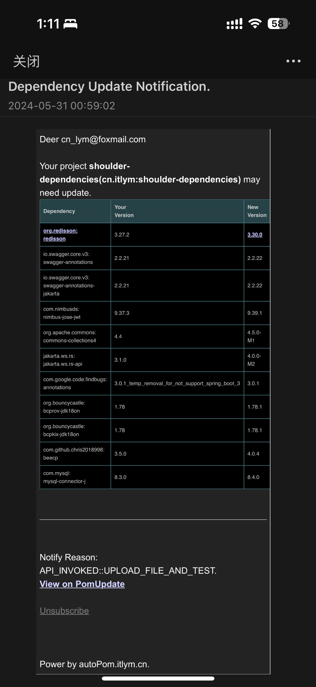

<h1 align="center"><a href="https://github.com/ChinaLym/pom-update" target="_blank">Pom-Update</a></h1>

# 📖Introduction [中文 language](README_zh.md)

**⚡ Fast** Check if any dependencies updates of your maven project. 

**💪 100x faster** than `mvn versions:display-dependency-updates`.


One step and you will received an email when dependencies update like this:




# 🚀 Quick Start

## 🌏 [Web UI](http://autopom.itlym.cn/) 👈

**upload a `pom.xml`** and wait an email if there were any new version of the dependencies in your project.

## 🔗 Web Url

Copy this url to your browser，**Note**: Replace the **📧Email**（`yourEmail@demo.com`） and **🔗pom.xml link** into yours.

> http://autopom.itlym.cn/projects/createWithUrl?email=yourEmail@demo.com&pomXmlUrl=https://raw.githubusercontent.com/ChinaLym/shoulder-framework/master/shoulder-dependencies/pom.xml&notifyInstantlyAfterCheck=true&notifyReason=ONLY_TEST_DEMO

# ⏬️ Run with local

⚡ Just **Clone and Run** it in `localhost:12345`!

```bash
git clone https://github.com/ChinaLym/pom-update
````

If you want to active notification, just complete the configuration in `application.properties`.

# 🚢 Run with Docker（Private Deploy）

## ⚡ Type1: Use Embedded Database(H2)

First, prepare an email and emailToken(obtain from your email settings)

Just run the script with your email and token.

```bash
docker run -p 12346:12345 -p 8000:8000 --name pom-update \
 -e EMAIL_SENDER_ADDR="YOUR_EMAIL@xxx.com" \
 -e EMAIL_TOKEN="YOUR_EMAIL_TOKEN" \
 -e DB_TYPE="h2" \
 -d registry.cn-hangzhou.aliyuncs.com/itlym/pom-update
```

## 🐬 Type2: Use MySQL

First, prepare an email and emailToken(obtain from your email settings)

Just run the script with your email and database settings.

```bash
docker run -p 12346:12345 -p 8000:8000 --name pom-update \
-e EMAIL_SENDER_ADDR="YOUR_EMAIL@xxx.com" \
-e EMAIL_TOKEN="YOUR_EMAIL_TOKEN" \
-e DB_TYPE="mysql" \
-e MYSQL_ADDR="YOUR_MYSQL_IP:3306" \
-e DB_USERNAME="pom_update" \
-e DB_USER="pom_update" \
-e DB_PWD="YOUR_PWD" \
-d registry.cn-hangzhou.aliyuncs.com/itlym/pom-update

```

env:
```text
# Email: such as demo@qq.com
EMAIL_SENDER_ADDR
# Email: SFTP Token
EMAIL_TOKEN
# MYSQL url and password
DB_TYPE(mysql / h2)
MYSQL_ADDR(localhost:3306)
H2_FILE_PATH(~/pomUpdateDb)
DB_USER(xxx)
DB_PWD(xxx)
LOG_LEVEL(debug/info/warn/error)
```

# 📩 Feedback & Contact

Thanks for your **[🌟Star](https://gitee.com/ChinaLym/shoulder-framework/star)** 、 **🍴Fork** 、 **🏁PR**.

Please feel free to contact with use in `issues`or [email to cn_lym@foxmail.com](mailto:cn_lym@foxmail.com) . For example: your ideas,
expectations~

> [Issue on Github if any questions](https://github.com/ChinaLym/pom-update/issues/new#留言自动激活邮箱还未打通，作者看到回)

# 🛰 Guide-Endpoint

## Test Page
http://localhost:12345/index.html

## Check all projects' dependencies if there were new releases version.
http://localhost:12345/test/version

## Send Email notification.
http://localhost:12345/test/notify

## Notification settings
http://localhost:12345/dependencies/updateNotifyStrategy?projectId=10&notifyStrategy=ALWAYS&email=your@demoemail.com

```bash
# TEMP TEST
curl --location --request GET 'http://localhost:12345/projects/createWithUrl?email=yourEmail@demo.com&pomXmlUrl=https://raw.githubusercontent.com/ChinaLym/shoulder-framework/master/shoulder-dependencies/pom.xml&notifyInstantlyAfterCheck=true&notifyReason=ONLY_TEST_DEMO' || echo '======= SKIP dependency check. ======='
```
```bash
# POST
curl --location --request POST 'http://localhost:12345/projects/create' --form 'email=yourEmail@demo.com' --form 'pomXml=@shoulder-dependencies/pom.xml' --form 'notifyInstantlyAfterCheck=true' --form 'notifyReason=CI-<a href="https://cicd.yourdomain.com/xxx/${DRONE_REPO_NAME}">${DRONE_REPO_NAME}::${DRONE_REPO_BRANCH}</a><br> with <a href="https://cicd.yourdomain.cn/gogs/${DRONE_REPO_NAME}/${DRONE_BUILD_NUMBER}">Drone Build-${DRONE_BUILD_NUMBER}</a><br>' || echo '======= SKIP dependency check. ======='
```

----

**Give me a [🌟Star](https://gitee.com/ChinaLym/shoulder-framework/star)** if you like the project, Thanks 💖
